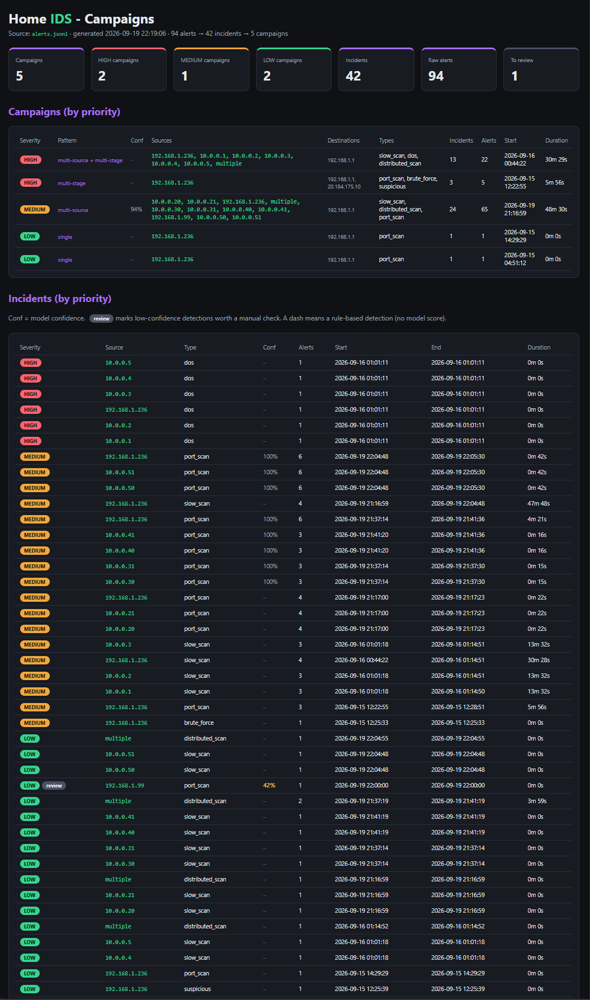
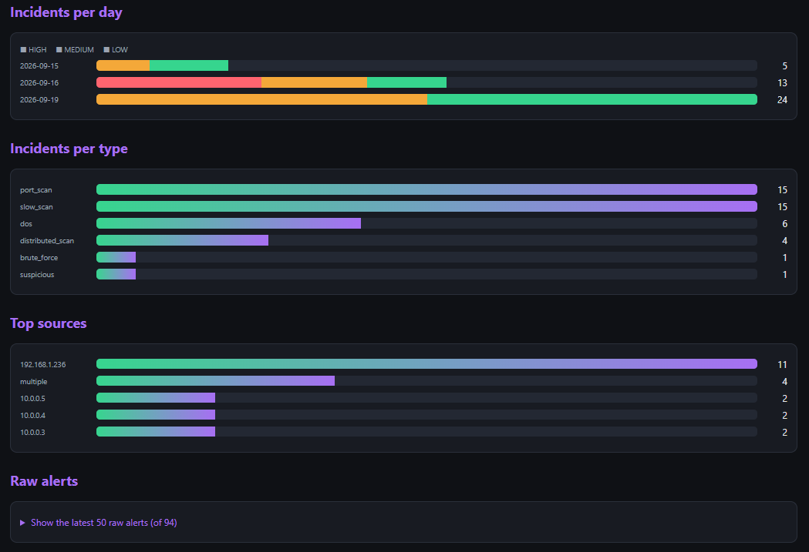

# Home IDS — Machine-Learning Intrusion Detection for a Home Network

A real-time intrusion detection system for my own home network. It captures live
traffic, groups it into flows, and uses two machine-learning approaches together:
a **Random Forest classifier** for known attacks and an **Isolation Forest** for
anomalies. Detections are aggregated into incidents and campaigns, scored by
severity and model confidence, and shown on a live dashboard.

Everything is tested against my own infrastructure, with attacks I generate
myself against my own target — no abstract benchmark data.

## What it detects

- **Port scans**, including evasive variants: slow scans (timing), decoy scans
  (`nmap -D`), and distributed scans (many sources, one target)
- **Brute-force** (repeated login attempts against my own server)
- **DoS** (flood against my own server)
- **Anomalies** — traffic that does not match learned normal behaviour

## The story behind the model

The interesting part of this project is not "I trained a Random Forest". It is
what happened when I evaluated it honestly.

An early model reported **99.85% accuracy** and looked perfect. In production it
raised a **false "DoS FLOOD"** on what was actually a decoy port scan. When I
switched from a random train/test split to **leave-one-capture-out** evaluation
(hold out a whole capture, train on the rest), that same model scored **0.1%**
on a scan it had never seen — it classified nearly every scan flow as DoS.

The random split had hidden three real problems:

1. **A shortcut**: the model had learned "no reply traffic = attack", an artifact
   of how DoS was captured (same IP on both ends of `lo`).
2. **A direction bug**: flow direction was decided by IP alone, which is wrong when
   both ends share an IP — every packet was counted backward.
3. **A data-diversity gap**: attacks were captured one way each, so the model
   learned the *capture's fingerprint* (interface, tool, speed), not the behaviour.

Fixing these — **context features** (ports per source per window), removing the
shortcut features, correcting the direction, and adding diverse captures (including
a second connect-scan) — produced a model that classifies **every realistic scan
type at ~100% on held-out captures**, validated by leave-one-capture-out rather
than a misleading random split.

Full write-ups are in [`notes/`](notes/).

## Pipeline
capture (scapy / tcpdump)
-> flows + rich features + per-window context (features.py, context.py)
-> Random Forest (v2, set C) + Isolation Forest (live_ids.py)
-> alerts with confidence (alerts.jsonl)
-> incidents -> campaigns, severity + confidence (incidents.py, correlate.py)
-> live dashboard (dashboard.py --watch)

## Running it

Requires Python 3.10, run inside WSL (Ubuntu). Capture needs `sudo`.

```bash
python3 -m venv venv
venv/bin/pip install -r requirements.txt
# run the test suite
venv/bin/python -m pytest -v          # 24 tests
# live IDS (writes alerts to alerts.jsonl)
sudo venv/bin/python live_ids.py
# live dashboard, in another terminal (regenerates + auto-refreshes)
venv/bin/python dashboard.py --watch
# then open dashboard.html in a browser
# correlate the alert log into incidents and campaigns
venv/bin/python correlate.py
```
The active network interface is detected automatically (`net_iface.py`).

## Known limitations

- **`lo` is not capturable in my WSL setup** (both tcpdump and scapy return 0
  packets), so DoS and brute-force use single captures and are not
  leave-one-capture-out validated. Documented, not hidden.
- **Localhost live**: brute-force/DoS test traffic runs on `lo`, while the live
  IDS listens on the real interface, so those are validated on saved captures
  rather than live.
- **`normal_web` holdout ~83%**: web browsing is varied enough that a few flows
  look unusual. Isolated false positives are filtered by aggregation and the
  per-source/per-destination trackers.

## Screenshots




## Design philosophy

- A good IDS produces **few good alerts**, not many noisy ones: aggregate →
  correlate → prioritise (by severity *and* model confidence).
- A model is only as good as how representative its training data is (the
  domain-gap and data-diversity lessons above).
- Security is complementary layers: the ML classifier, the anomaly detector, and
  deterministic trackers each cover the others' blind spots.
- Heuristic detection flags suspicion, it does not prove intent.