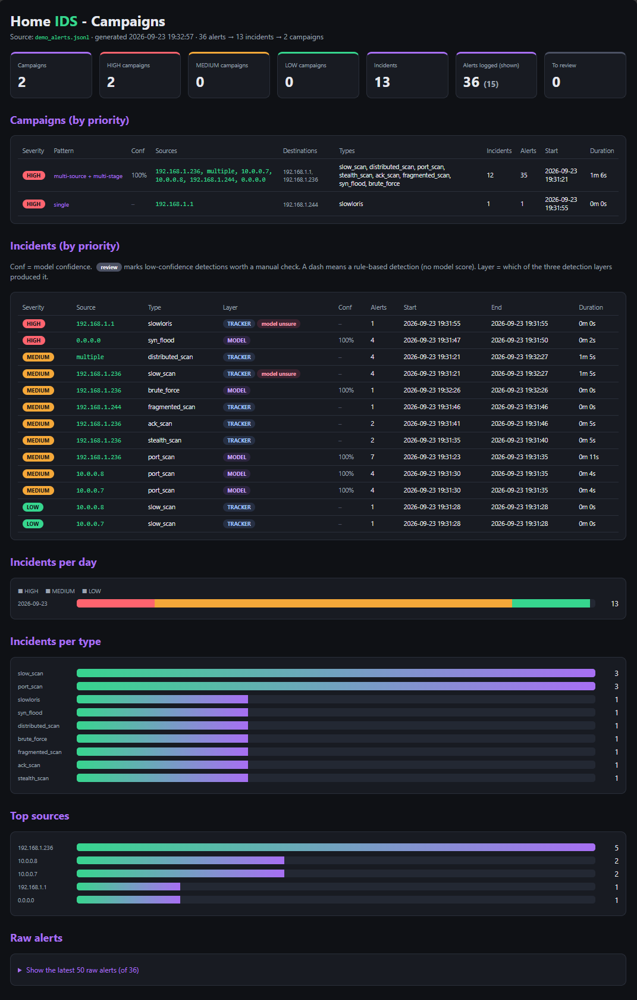

# Home IDS
[](https://github.com/master-ev/home-ids/actions/workflows/tests.yml)

A network intrusion detection system for my own home network: three detection
layers (Random Forest, deterministic trackers, anomaly detection), 10 attack
types, 5 evasion techniques defended, and - the part I care about most - every
claim below measured against traffic the system had never seen.

**0 false notifications in 1.19 million packets of real home traffic.**
**11/11 unseen attack captures detected.** 240 tests, ~90% coverage on core modules.



## The story: 99.85% that meant nothing

The first model scored 99.85% on a random train/test split. In production it
labelled a decoy scan as a DoS flood. Leave-One-Capture-Out evaluation - training
on every capture except one, testing on that one - gave **0.1%** on the unseen
scan.

Three causes, all found by diagnosing with data instead of guessing:
- a shortcut: "no reply = attack", learned from captures where only attacks went
  unanswered
- a direction bug: flow direction decided on IP alone, not (IP, port)
- missing diversity: the model had learned the fingerprint of each capture, not
  the behaviour

The fixes (context features, an explicit `is_tcp` feature, direction on (IP, port),
diverse captures across sources, tools and protocols) took set D to a LOCO mean of
~99%. Every number in this README is measured the same way: on captures the model
never saw, replayed through the exact live pipeline - and, where noted, against
live traffic on the wire.

## Architecture

Traffic is captured in 5-second windows and grouped into flows. Each window goes
through three independent layers:

| Layer | What it does | Where it fails |
|---|---|---|
| **Random Forest** (feature set D, 25 features) | labels each flow: scan, udp_scan, dos, brute force, SYN flood | size-based features: a padded scan drops it to conf 0.34 |
| **Deterministic trackers** | temporal and structural patterns the model cannot see in one window: slow scans, distributed scans, SYN floods, ICMP floods, Slowloris, fragmentation, NULL/FIN/XMAS flags, ACK probes | nothing that needs statistics |
| **Anomaly detection** (IsolationForest) | flows unlike anything in the normal traffic it was trained on | see below |

Model alerts below 0.70 confidence are dropped: a model that is unsure must not
put a label on something. The fact that it was unsure is attached to the tracker
alerts of that window - low confidence plus firing trackers is itself an evasion
signal.

Alerts are then aggregated: alerts → incidents (same source, type, time window) →
campaigns (multi-source, multi-stage), with severity and aggregated confidence.
The dashboard shows incidents and campaigns, never raw alerts.

                         ┌─────────────┐
   tcpdump / sniff  ───► │   packets   │
                         └──────┬──────┘
                                │  one-pass field extraction (packet_view)
                         ┌──────▼──────┐
                         │    views    │
                         └──────┬──────┘
                    ┌───────────┼───────────────────────┐
                    │           │                        │
              flows (per key)   │                  whole-window scan
                    │           │                        │
         ┌──────────▼───┐  ┌────▼─────────┐   ┌──────────▼──────────┐
         │  features +  │  │  DETERMINISTIC│   │   DETERMINISTIC     │
         │   context    │  │   TRACKERS    │   │   packet trackers   │
         └──────┬───────┘  │ (per flow)    │   │ fragment, icmp,     │
                │          │ syn_flood,    │   │ stealth (NULL/FIN/  │
       ┌────────┼──────┐   │ slowloris,    │   │ XMAS)               │
       │        │      │   │ ack_scan      │   └──────────┬──────────┘
  ┌────▼───┐ ┌──▼───┐  │   └───────┬───────┘              │
  │ RANDOM │ │ISOLA-│  │           │                      │
  │ FOREST │ │TION  │  │           │                      │
  │ (class)│ │FOREST│  │           │                      │
  └────┬───┘ └──┬───┘  │           │                      │
       │        │      │           │                      │
       └────────┴──────┴───────────┴──────────────────────┘
                                │
                    ┌───────────▼───────────┐
                    │   alert policy         │
                    │  (family, cooldown,    │
                    │   confidence >= 0.70)  │
                    └───────────┬───────────┘
                                │
                         alerts.jsonl ─► incidents ─► dashboard

   THREE COMPLEMENTARY PARADIGMS:
   1. Classification (Random Forest)  — known attacks with a learned signature
   2. Deterministic trackers          — structural/temporal attacks (scan, flood,
                                         slowloris, stealth, fragmentation)
   3. Anomaly detection (Isolation Forest) — what is simply unusual

### The third layer, measured

The anomaly layer is meant to catch what the other two have never seen. Measured
on real traffic and on unseen attacks:

| | real normal traffic (holdout) | ack_scan | stealth_sX |
|---|---|---|---|
| trained on lab captures only | **89.2%** of flows flagged | 0% | 0% |
| + real-traffic flows | 2.6% | 0% | 0% |

Trained on lab captures alone it flagged almost all real traffic (28.6 false
notices/hour in the first valid soak). On the two genuinely unseen attacks it
flagged nothing, before or after: the deterministic trackers caught them. Replaying
all 23 attack captures with and without the layer changed the log on **zero** of
them.

It is kept as a net for the unknown, at a contamination level diagnosed against a
held-out half of real traffic, and its detection value is documented as **unproven
rather than claimed**.

## Real-time performance

The system has to keep up with traffic live, not just replay captures fast enough.
On a DoS capture (73,659 packets, 4,759 flows per window), a 5-second window
started at 28 seconds of processing - a 0.2x margin, meaning the kernel would drop
packets under a real flood. Profiling, not guessing, drove every fix:

| Change | dos.pcap window | margin |
|---|---|---|
| starting point | 88.2 s | 0.2x |
| batch prediction (one call per window, not per flow) | 19.9 s | 1.0x |
| linear scan state (deque + incremental port counts) | 13.6 s | 1.5x |
| one-pass packet field extraction | 11.1 s | 1.8x |

Each step was found with a profiler and guarded against regression by requiring
`metrics.md` to stay identical on detection. Two guesses along the way were wrong
by an order of magnitude, and the profiler said so - the model prediction batching
helped far more than expected, the main-loop rewrite far less.

## Live validation

Everything above is replay. Replay reads from disk and never pays for capture,
kernel buffering, or scheduling under load - so the margins are a statement about
CPU, not about the system. The system was then run on the real interface under a
controlled SYN flood generated with `hping3` against the router:

- capture path lost **0 packets** (tcpdump kernel counter: 0 dropped of 200,237)
- the IDS raised SYN FLOOD every window, 13,269 half-open connections counted
- a live SYN scan (`nmap -sS`) raised the scan trackers correctly

These are point-in-time lab measurements, not regenerated by the report; the full
set with limitations is in the Live validation section of `metrics.md`.

## Evasion techniques

| Technique | Result |
|---|---|
| Timing (slow scan) | defended: per-source tracker |
| Decoys (`nmap -D`) | defended: per-destination tracker + explicit `is_tcp` |
| Fragmentation (`nmap -f`) | defended: packet-level fragment tracker (evaded completely at first) |
| Flag anomalies (NULL/FIN/XMAS) | defended: structural signature (RFC 793) |
| ACK scan (`nmap -sA`) | defended: lone-ACK-probe tracker |
| Source-port spoofing (`nmap -g 53`) | **tested, not an evasion here** - direction comes from the probe, not from port numbers |
| Padding (`--data-length`) | **the model fails** (udp_scan at conf 0.34); the trackers catch it; the alert says the model was unsure |
| SYN flood with payload | **the model fails** (found live, not in replay); a deterministic SYN flood tracker catches it by structure, independent of payload |

## Method

Every fix in this project followed the same loop: **diagnose with data, then fix -
never guess**. A diagnostic script before every change (`diagnose_*.py`, 10 of them),
a failing test that reproduces the bug, the fix, a mutation that proves the test
guards it, and a before/after measurement in `metrics.md`.

Three bugs in this project were wiring bugs: the logic was right, the connection
was missing, and no test checked the output ([day 60](notes/), [day 65](notes/),
[day 70](notes/)). Each one added a test at the layer where it slipped through.

### Four questions, not one

Most IDS projects report one number: did it detect the attack? This one measures
four, because days 60-79 showed they are different questions.

| Question | Result |
|---|---|
| **Detected?** any alert at all | 11/11 unseen, 13/13 in-training |
| **Correctly labelled?** the right kind is in the log | 9/11 unseen, 13/13 in-training |
| **Label shown?** the right kind reaches the console, not just the log | 22/24 |
| **Wrong labels in log?** labels that do not describe the capture | **0/24** |

The two captures missing *Label shown* are the padded scans: the model falls below
the confidence filter, the trackers catch the scan, and the console shows
`SLOW PORT SCAN ... [model unsure]` instead of `PORT SCAN`. The attack is detected
and the analyst is told the classifier could not label it.

### Noise

**175 alerts logged, 46 notified.** Every alert is written to `alerts.jsonl` -
`incidents.py` needs the full evidence, since severity depends on alert counts.
Only the first per (source, destination, family) within 60 seconds is shown to the
human, and the next notice lists which detectors stayed silent. One decoy scan went
from 79 console lines to 7, with every one of its six sources still reported.

240 tests · ~90% coverage on the core modules · 40+ dated engineering notes

### False positives on real traffic

Lab captures of a few minutes are not evidence. The system was measured against
two captures of real home traffic (taken on the Windows host with `pktmon`,
replayed through the exact live pipeline), no attacks running, so every alert is a
false positive by construction:

| | duration | packets | notified |
|---|---|---|---|
| held-out half of capture 1 | 0.41 h | 381,467 | **0** |
| capture 2, fully unseen, another part of the day | 0.54 h | 810,224 | **0** |

Before the normal-traffic data was added to the anomaly model, the same held-out
half produced 14.5 false notifications per hour.

The first attempt at this measurement produced 75 windows and **0 packets**: the
sensor in WSL2 saw none of the Windows host's traffic. Zero observations is not
zero false positives, and the reporting tool now refuses such a session
([day 72](notes/day72_sensor_visibility.md)).

## What I learned

A few lessons that shaped the project, each with the evidence behind it:

- **Random splits hide models that don't generalize.** 99.85% on a random split,
  0.1% under leave-one-capture-out. LOCO became the real metric.
- **The wire finds what replay can't.** A SYN flood carrying payload passed
  undetected live - every training example had been payload-free, and there was no
  deterministic SYN flood tracker behind the model. Only live testing surfaced it;
  the fix was a structural tracker, not retraining.
- **A confidently displayed number is not a verified one.** "43 features" was
  really 25 for most of the project - 18 were duplicates from a loop that ran
  twice. Nothing crashed; a duplicated feature just silently doubles its weight in
  the forest.
- **A new structure inherits the old one's blind spots silently.** A one-pass
  packet extractor didn't handle IPv6 while the function it replaced did, so the
  trackers ignored all IPv6 traffic for a day - surfaced only when another change
  indexed the same gap. When you replace a function, read the whole old one.
- **Diagnose before you fix.** Every performance win came from a profiler pointing
  at the real bottleneck - including the two times my guess was wrong by an order
  of magnitude.

`notes/` holds 40+ dated notes, one per working session: the diagnosis that
preceded each change, the hypotheses that data rejected, and the decisions not to
fix something. A few that show the method:

- [day 60](notes/day60_stealth_scans.md) - detected is not the same as correctly labelled
- [day 63](notes/day63_anomaly.md) - the anomaly layer flagged 89% of real normal traffic
- [day 72](notes/day72_sensor_visibility.md) - a soak test that measured nothing, and why
- [day 74](notes/day74_anomaly_value.md) - measuring what a whole layer adds: zero
- [day 77](notes/day77_source_port_scan.md) - an evasion technique that turned out not to be one

---

## Running it

```bash
python3 -m venv venv
venv/bin/pip install -r requirements.txt
venv/bin/python setup_check.py          # what is present and what needs building

sudo venv/bin/python live_ids.py        # live, on the auto-detected interface
venv/bin/python correlate.py            # alerts -> incidents -> campaigns
venv/bin/python dashboard.py            # writes dashboard.html

venv/bin/python metrics_report.py --all # regenerate metrics.md (replay + tests + LOCO)
```

Captures, models and alert logs are gitignored: `setup_check.py` lists what to
build and which script builds it.

CI runs the data-independent part of the suite on every push. The rest replay
captures, which are gitignored because they contain real home traffic. Locally,
with the captures present, the full suite of 240 tests runs.

## Limitations

- **Sensor placement**: a NIDS sees only what reaches its interface. On a switched
  network that is its own traffic plus broadcast; real deployments use a SPAN port
  or a TAP. The soak captures were taken on the Windows host for this reason.
- `lo` cannot be captured in WSL, so the DoS and brute-force captures come from a
  single source and are not LOCO-validated.
- **ACK scan probes are ignored by the scan trackers** since day 65 (they are
  ACK-first flows). A dedicated tracker covers them; `nmap -sA` is detected, but
  the general port trackers are blind to ACK-only probes.
- `slowloris_triple` uses `min(sport, dport)` as the server port: wrong under
  `nmap -g 53` when the scanned port is above 53. Harmless today (Slowloris needs a
  completed handshake and persistence), pinned by a test that documents it.
- The anomaly layer's detection value is unproven (see above).
- The soak and live measurements come from one host on one network, on a few
  evenings; a payload flood and a full-connection flood were not stress-tested for
  packet loss.
- Deduplicating feature set D cost some LOCO generalization margin on held-out DNS
  traffic (worst-case 88.6 → 74.4), with no effect on normal-traffic false
  positives (still 0). Kept for correctness: an honest 25-feature set over an
  inflated 43.
- The v1 model (`my_model.joblib`) is a fallback for `USE_V2 = False` and is not
  loaded in normal operation.
- Tracker alerts report the port count at the moment the threshold was crossed
  (15), not the final total (200).
